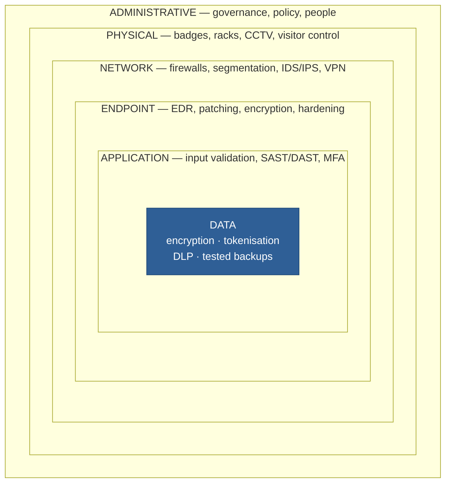
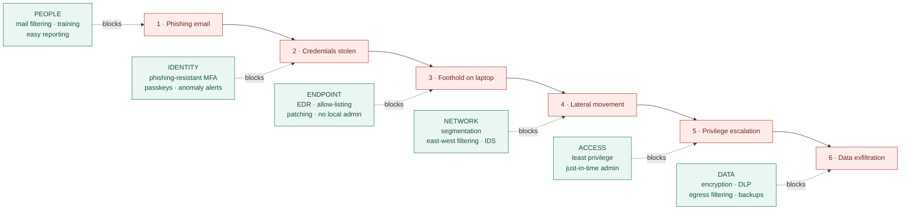

# Nobody Builds a Castle With One Wall: Defense in Depth

### Part 1 of *Security Principles for Technology Companies*

---

## The single wall problem

In 1929, France began building the Maginot Line: a chain of fortresses, gun emplacements and tunnels along its border with Germany, engineered to a standard that genuinely deserved the word *impregnable*. It was one of the most sophisticated defensive works ever constructed, and by most accounts it worked exactly as designed.

In May 1940, German forces drove through the Ardennes forest to the north and went around it.

The Maginot Line has become the standard cautionary tale for a reason, and it is not that the fortifications were bad. They were excellent. The failure was structural: an enormous share of a nation's defensive budget had been concentrated into a single control, and the entire strategy assumed that control would not be bypassed. When it was, there was nothing behind it.

This is the exact shape of most security incidents I read about today. Not "the company had no firewall." Almost always: "the company had a very good firewall, and the attacker came in through a contractor's VPN account that did not have multi-factor authentication."

**Defense in Depth is the design principle that answers this problem.** It says: build your security as a series of independent layers, on the explicit assumption that any single layer will eventually fail. Not *might* fail — *will* fail. Your job as a defender is not to build a wall that cannot be breached. It is to make sure that breaching one wall does not mean losing the building.

It is worth being blunt about why this deserves a full post rather than a bullet point. "Defense in Depth" is used so casually in vendor marketing that it has started to sound like a synonym for "we sell several products." It isn't. It's a specific architectural claim about *independence between controls*, and most programs that believe they have it actually do not. Getting the distinction right is the difference between a breach that is a bad week and a breach that is a bad year.

---

## Where the idea comes from

The phrase is borrowed, and the borrowing is not decorative — the military version of the concept carries the part people most often drop.

Classical and medieval fortification is the intuitive version, and it's the one everyone reaches for: a castle has a moat, then a curtain wall, then an inner bailey, then a keep, and the defenders retreat inward as each is lost. The historian Edward Luttwak famously argued in *The Grand Strategy of the Roman Empire* (1976) that the later Roman Empire shifted from a thin, fortified frontier toward a "defense-in-depth" posture with mobile reserves held well behind the border — a reading historians still argue about, but one that captures the essential trade.

The doctrine in its modern military form was formalised in the First World War. By 1917 the German army had largely abandoned the practice of packing troops into a single heavily-held forward trench, where a sufficiently large artillery barrage could annihilate the entire defense in an afternoon. In its place came *elastic defense in depth*: a lightly-held forward zone, a battle zone behind it, and counter-attack reserves further back still. The forward positions were expected to be lost. They were designed to be lost. Their purpose was to slow the attack, break up its cohesion, and expose it to a counter-attack while it was strung out and beyond its own artillery support.

That is the piece that gets left behind when the idea is reduced to "castle walls," and it matters enormously for security:

> Depth is not only about stopping the attacker. It is about **buying time, forcing noise, and creating the conditions to respond.**

The Soviet defenses at Kursk in 1943 — belt after belt of trenches, minefields and anti-tank positions dozens of kilometres deep — are the doctrine at its most literal. The attack was not stopped at the first line. It was ground down across many.

The term crossed into information security formally around the turn of the millennium, most influentially through the US National Security Agency's *Information Assurance Technical Framework*, which built its model on three pillars: **people, technology and operations**. That triad is still the most useful correction to a purely tooling-based reading of the principle. Today the idea is baked into effectively every major security framework — NIST's control catalogues, ISO 27001's structure, the CIS Controls — usually without needing to name itself.

---

## The layers, and what actually makes them layers

The classic model divides controls into three families. It's worth stating them precisely, because the boundaries do real work.

**Administrative controls** are the decisions and processes: policies, standards, risk acceptance, onboarding and offboarding, security awareness training, vendor review, incident response plans. These are the controls that determine whether the other two families are correctly configured, so they sit outermost — everything else inherits its quality from here.

**Physical controls** are the ones a person could touch: badge readers, locked server racks, cameras, visitor escorting, cable locks, shredders, and the fact that your data centre has a door. Easy to dismiss in a cloud-native company right up until someone walks out of your office with an unlocked laptop, or a stranger tailgates through reception and plugs into a wall port.

**Technical (logical) controls** are the machinery: firewalls, MFA, encryption, EDR, logging and monitoring, network segmentation, code review pipelines. This is the family most people think of as "security," and it is roughly one third of the picture.

Each family is also usually described by *function*: **preventive** (stop it happening), **detective** (notice it happening), **corrective** (fix it afterwards), plus deterrent and recovery controls. A serious program has all of these on every layer. A program with excellent prevention and no detection is a program that will learn about its breach from a journalist.

### Diagram 1 — the layer model

*An attacker has to defeat every layer. A defender only needs one to hold.*

### The part that separates the real thing from the imitation

Here is the trap, and it catches experienced teams.

**Stacking controls is not the same as layering them.** Three antivirus products on one laptop are not three layers — they are one layer bought three times. They inspect the same objects, they use similar detection logic, they run on the same operating system with the same privileges, and a technique that evades one is disproportionately likely to evade all three. In reliability engineering this is called *common-mode failure*: components that look independent but share a hidden dependency, so they fail together.

Real depth requires controls that fail for **different reasons**. A firewall fails to a misconfiguration. An EDR agent fails to a novel technique. MFA fails to a determined social-engineering call. Encryption at rest fails to stolen credentials. Because their failure modes are unrelated, the probability of all of them failing on the same day is genuinely small — which is not true of three copies of the same control.

James Reason's **Swiss cheese model**, developed in the 1990s to explain accidents in aviation and medicine, is the cleanest way to hold this. Every layer of defense is a slice of Swiss cheese: it has holes, because every control has weaknesses. An accident happens only when the holes in every slice happen to line up. Your work as a security architect is to make sure the holes are in *different places* — and to keep in mind that the holes move, because your environment changes every week.

The uncomfortable corollary: **layers are not free.** Each one adds cost, latency, and friction, and friction produces workarounds. A control that makes engineers' work impossible does not add a layer; it adds a shadow IT system that has none. Depth is an engineering trade-off, not a moral virtue, and "add another tool" is not automatically the right answer.

---

## Defense in Depth in a technology company

For a technology-driven business, the principle stops being an abstraction the moment you draw your actual attack surface: a distributed workforce, a cloud estate, a CI/CD pipeline that can deploy to production, a supply chain of hundreds of third-party dependencies, and customer data as the crown jewel. Here is how the layers translate.

### Network security

The old model was a hard perimeter with a soft interior — get through the firewall and you can talk to everything. That model died with the office, and its failure mode is well documented: in the 2013 Target breach, attackers entered using credentials belonging to a refrigeration and HVAC contractor, then moved from that entry point to point-of-sale systems because the internal network placed too few obstacles between the two.

Modern depth here means **segmentation** — production separated from corporate, environments separated from each other, sensitive workloads isolated — plus east-west traffic filtering, so an attacker who lands somewhere cannot trivially reach everywhere. This is the practical core of what is now marketed as Zero Trust: not the absence of a perimeter, but many small perimeters and no implicit trust based on network location.

### Application security

Your application is the part of your company that is deliberately exposed to the internet, so depth here means controls at every stage rather than a scan at the end. Threat modelling at design time, secure coding standards, SAST in the pull request, dependency and container scanning in the pipeline, DAST against staging, a WAF and rate limiting in production, and a bug bounty or pentest as the outermost net.

The 2017 Equifax breach is the standard illustration of what happens without depth: an unpatched vulnerability in Apache Struts provided entry, and the consequences were compounded because internal traffic inspection had lapsed and sensitive data was insufficiently segmented and protected. No single one of those failures had to be fatal. Together they were.

### Endpoint security

Every laptop is a potential foothold, and in a remote-first company it is very often *the* foothold. Depth here is full-disk encryption, centrally-managed patching with a real SLA, EDR with someone actually reading the alerts, removal of standing local administrator rights, MDM baselines, and application allow-listing where you can tolerate it. The single highest-value item on that list is usually the removal of local admin, because it degrades the value of nearly every technique that follows a successful phish.

### Data security

Assume the attacker reaches the data, and ask what they get. Encryption at rest and in transit, tokenisation or field-level encryption for the most sensitive fields, strict key management with keys held separately from the data, data classification so people know what they're handling, DLP and egress filtering, and **backups that are offline, immutable, and — critically — restore-tested**.

Maersk's recovery from NotPetya in 2017 is the case study every engineer should know: a global shipping company rebuilt its Active Directory largely because a single domain controller in Ghana had been offline during a power cut and survived. That is not a backup strategy. That is luck, standing in for the layer that was missing.

### The human element

People are not "the weakest link," and framing them that way produces exactly the culture you do not want: staff who hide their mistakes. People are a **layer with distinctive properties** — they are the only layer that can notice something is wrong for reasons no rule anticipated, and they will only do it if reporting is fast, blameless, and thanked.

Depth on this layer means role-relevant training rather than an annual video, phishing simulations used as a measurement rather than a punishment, phishing-resistant MFA so a stolen password is not a breach, least privilege so a compromised account is a small problem, and a reporting path so trivial that people use it when they are only 20% sure. The 2021 Colonial Pipeline intrusion reportedly began with a legacy VPN account that lacked MFA — the human and identity layers failing together, before a single technical exploit was needed.

### Diagram 2 — one breach, six chances to stop it

*An intrusion is a chain. A single-layer program has to win six times out of six; a layered program only has to win once.*

---

## What to take away

- **Assume failure.** Defense in Depth begins with accepting that every control you own will eventually be bypassed, misconfigured, or outdated. Design for what happens next.
- **Independence beats quantity.** Layers only count if they fail for different reasons. Three of the same control is one layer with a bigger invoice.
- **Cover all three families.** Administrative, physical and technical — and within each, preventive, detective *and* corrective. Prevention without detection means finding out from someone else.
- **Depth buys time.** Slowing an attacker down is a win in itself, because it converts a silent breach into a noisy one you can respond to.
- **Layers have costs.** Every control adds friction, and friction breeds workarounds. Choose depth deliberately, where the risk justifies it.

The Maginot Line's real lesson was never "build better walls." It was that a defense which assumes it cannot be bypassed has no plan for the day it is.

---

## Next in this series

Defense in Depth tells you to build many layers. It does not tell you how to keep each of those layers small enough to be worth having — and a layer that grants everyone access to everything is a layer in name only.

**Next up: the Principle of Least Privilege** — why the most effective security control in most organisations is not a product you buy but permissions you take away, how privilege creep quietly rebuilds the flat network you spent a year segmenting, and what just-in-time access looks like in a company that ships every day.

*Follow along if you want the rest of the series. If you disagree with something here — particularly on where layering stops paying for itself — I'd like to read it in the responses.*

---

*Sources worth linking if you want citations: Edward Luttwak, "The Grand Strategy of the Roman Empire" (1976); NSA, "Information Assurance Technical Framework" v3.x (~2000–2002); James Reason, "Human Error" (1990); the US Senate Commerce Committee report on the 2013 Target breach; the US GAO report on the 2017 Equifax breach; Andy Greenberg, "The Untold Story of NotPetya," Wired (2018).*

<!--
Publishing notes (delete this block before posting):
- Suggested subtitle: Why the strongest security programs are the ones that assume every control will eventually fail.
- Tags: Cybersecurity, Defense In Depth, Information Security, Security Architecture, Technology
- Medium does not render Mermaid. Paste each Mermaid block into mermaid.live, export as PNG,
  and upload the image in place of the code block. Everything else pastes in fine.
-->
