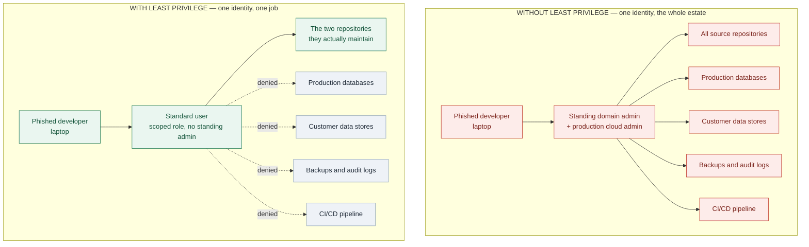
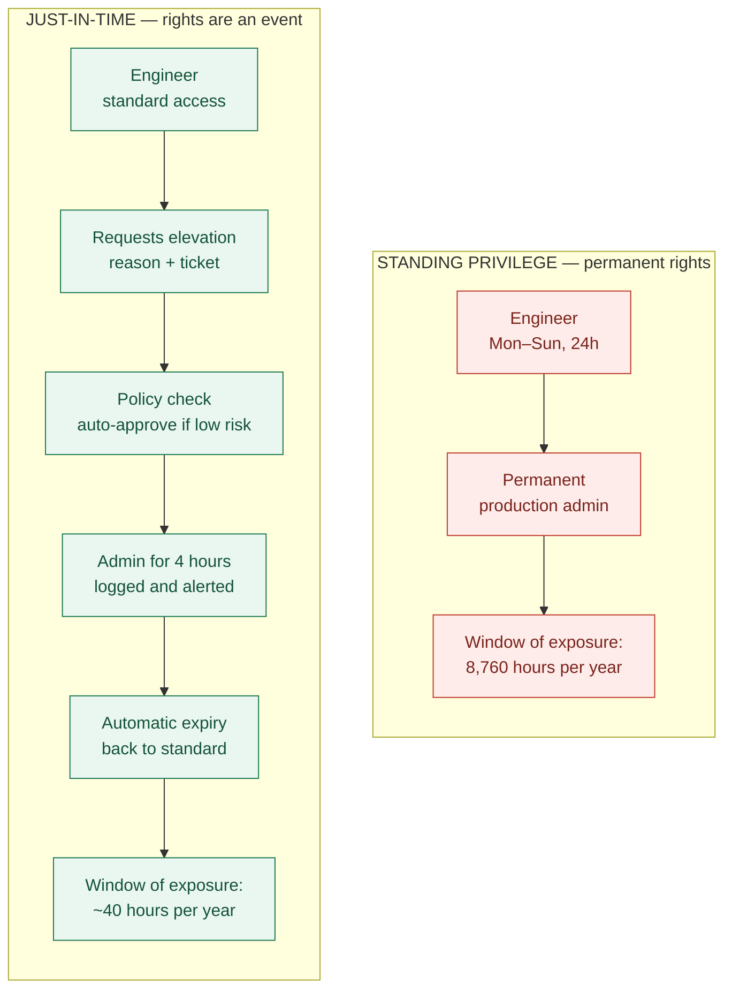
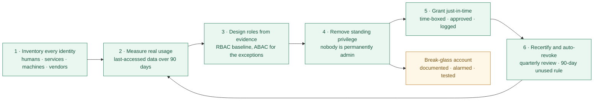

# Nobody Needs the Master Key: The Principle of Least Privilege

### Part 2 of *Security Principles for Technology Companies*

---

> *In [Part 1](#) I argued that good security is built in layers, on the assumption that every one of them will eventually fail. This post is about the other axis. Layers decide how many obstacles an attacker meets. Privilege decides how much they get when one of those obstacles gives way.*

---

## The hotel key problem

Consider how a well-run hotel handles keys. A guest's card opens one room and the gym, and it stops working on checkout day. Housekeeping's card opens the rooms on one floor, during one shift. The night manager can open anything, but that card lives in a safe, its use is logged, and taking it out is an event somebody notices the next morning.

Nobody proposes giving every guest a master key on the grounds that it would be more convenient at the front desk.

In IT, we do it constantly.

**The Principle of Least Privilege says that every user, process, service and device should have exactly the permissions it needs to do its job — no more — and should hold them only for as long as the job takes.** It is one of the oldest ideas in computer security in this precise form: Jerome Saltzer and Michael Schroeder set it out as a core design principle in *The Protection of Information in Computer Systems* in 1975. Half a century later it is still, by a wide margin, the most under-implemented idea in the field.

Three words in that definition carry the weight, and each one is routinely dropped in practice:

- **Every** — not just people. Service accounts, API tokens, CI/CD pipelines, containers, cron jobs, third-party integrations and scripts are all identities, and in most companies they now outnumber the humans several times over. They are also, on average, far more over-privileged, because nobody complains on their behalf and nobody remembers they exist.
- **Needs** — needs, demonstrated by evidence, not *might one day want*. "Just give them admin, it's easier" is a decision to accept an unbounded risk in order to avoid a ten-minute conversation.
- **As long as the job takes** — privilege is a state you enter and leave, not a property you own. Permanent admin rights are the security equivalent of taping the master key under the front desk because someone might need it at 3 a.m.

Here is why this is a cornerstone principle rather than a piece of hygiene. Least Privilege does not try to stop attacks. It accepts, exactly as Defense in Depth does, that something will eventually go wrong — and it decides *in advance* how much can go wrong when it does. It is the control that determines whether a compromise is an incident or a catastrophe.

---

## Why it matters: privilege is the multiplier

Almost no major breach is a single failure. There is an entry point, and then there is the thing that turns the entry point into a headline. That second thing is nearly always excessive privilege.

### Capital One, 2019

An attacker exploited a server-side request forgery flaw to reach the cloud instance metadata service and retrieve the credentials of an IAM role attached to a misconfigured web application firewall. The intrusion was possible because of the SSRF bug. It affected the personal data of roughly a hundred million people because that role held permissions to list and read a large set of S3 buckets it had no operational reason to touch.

Run the counterfactual, because it is the whole argument in one line. Same exploit, tightly scoped role: a serious security bug, an embarrassing incident report, no data loss. Over-scoped role: one of the largest financial-sector breaches on record. The vulnerability was identical in both cases. Only the permissions differed.

### Target, 2013

The entry was credentials belonging to a refrigeration and HVAC contractor. Consider what such a vendor legitimately needs: submit invoices, read work orders, maybe view a maintenance schedule. What the account could actually reach was a path toward point-of-sale infrastructure.

The failure was not that a vendor was compromised — assume your vendors will be compromised, because some of them will. The failure was that a vendor identity had a reach nobody had ever been asked to justify.

### Ransomware, every single week

The modern playbook is not "encrypt the machine we landed on." It is: land somewhere ordinary, harvest credentials from memory, escalate to domain administrator, and *then* deploy to the entire estate simultaneously using the same management tooling the IT team uses on a normal Tuesday.

The reason ransomware is an existential event for some companies and a bad afternoon for others is almost entirely this: whether an account existed that could write to everything. Remove standing domain admin and the same intrusion encrypts a department instead of a company.

### The cases that are not attacks at all

A well-documented category of major outage is an experienced engineer running the correct command against the wrong environment, because their account could reach both. Least Privilege is a safety control as much as a security control — it is the reason a tired engineer's mistake at 11 p.m. is recoverable rather than career-defining.

And on the deliberate-insider side, the Snowden case remains the canonical study in privilege without need-to-know: the access came from an administrative role whose scope had never been questioned, and one of the responses afterwards was to sharply reduce the number of such roles and require two people for the most sensitive operations.

The pattern across all of them is identical:

> **Privilege is not the vulnerability. Privilege is the multiplier that decides what the vulnerability costs you.**

### Diagram 1 — the blast radius of one compromised laptop

*Identical phishing email, identical laptop, identical malware. The only variable is what the account was allowed to reach.*

---

## Where it applies, concretely

The principle is abstract. Implementing it is not — it is a specific set of decisions in each technology domain, and they are mostly unglamorous.

### Operating systems

Remove standing local administrator rights from user workstations. This single change neutralises or degrades a large share of post-phishing techniques, and it is usually the highest-value item available to a small IT team.

Beyond that: replace blanket `sudo ALL` with named commands granted to named groups. Run every service under its own dedicated, non-interactive, non-login account rather than under root or a shared one. Use mandatory access control — SELinux or AppArmor — so a compromised process stays confined even while running as the account it was supposed to run as. On Windows estates, adopt an administrative tiering model so that a credential used to manage laptops cannot be replayed against domain controllers, which is precisely the movement most ransomware operations depend on.

### Databases

The application should never connect as `root`, `sa`, or the schema owner. Give it an account with the specific verbs it uses on the specific tables it touches — and notice that most applications need `SELECT`, `INSERT` and `UPDATE`, and essentially never need `DROP`.

Split the migration user, which needs DDL rights during a deploy, from the runtime user, which does not. Point analytics and BI tools at a read-only replica. Where the platform supports row- and column-level security, use it, so that "access to the customers table" does not automatically mean access to every customer's national ID number.

The payoff is easy to state: a SQL injection flaw in an application connected as a scoped user is a bad bug. The same flaw connected as superuser is a full database compromise, plus whatever else that account can reach.

### Network devices

Authenticate engineers individually through TACACS+ or RADIUS with per-command authorisation, rather than through a shared `enable` password that half the department knows and nobody has rotated since the last person left. Keep management interfaces on an out-of-band network. Give monitoring systems read-only accounts. The goal is that "who changed this ACL at 2 a.m., and why" is a question with an answer.

### Cloud environments

This is where the principle matters most and where it degrades fastest, because cloud IAM makes over-granting effortless: a wildcard is one character, and it always works on the first try.

- **Roles, not keys.** Short-lived, automatically rotated credentials instead of long-lived access keys pasted into config files.
- **Scope and condition every policy.** Specific resources, plus conditions on source network, tags or time.
- **Set a ceiling you cannot exceed by accident.** Permission boundaries and organisation-level guardrails — AWS SCPs, Azure management group policies, GCP org policies — so that a mistaken grant still cannot escalate beyond a hard limit.
- **Treat the account, subscription or project as the real blast-radius boundary.** Production should not be a namespace inside the same account as a sandbox.
- **Harden the metadata service** (IMDSv2 or equivalent), so an SSRF bug does not hand over role credentials. That is the exact link in the Capital One chain where least privilege at the infrastructure layer would have broken the attack.
- **Use the evidence the platform already collects.** Last-accessed data, IAM Access Analyzer, policy recommenders and CIEM tooling all exist to answer one question: which of these permissions has this identity never once used?

### CI/CD and the supply chain

Ask a deceptively simple question: which identity in your company can push code to production without a human approving it?

For most technology companies the answer is the build pipeline. That makes it the most powerful identity you own, and frequently the least reviewed. Federate it with short-lived OIDC tokens instead of static cloud keys, scope credentials per repository and per environment, require approvals on protected environments, and separate the ability to *build* from the ability to *deploy*. The SolarWinds compromise is the reference case for why a build system deserves the same scrutiny as a domain controller.

---

## The challenges, honestly

Every organisation that has attempted this has hit the same walls. Pretending otherwise is how Least Privilege programmes quietly die in month three.

**"Nobody knows what access is actually needed."** This is the real blocker, and it is genuine — the person who granted the permission left two years ago and the documentation never existed. The answer is to stop guessing and start measuring: run in audit or log-only mode, collect 60–90 days of actual usage from access logs and last-accessed metadata, then right-size from evidence. Evidence also wins the argument with the team whose access you are cutting, because you are showing them their own data rather than your opinion.

**"It'll break production at the worst possible moment."** A legitimate fear, and the answer is not courage — it is **break-glass**. A small number of documented emergency accounts with elevated rights, stored in a vault, whose use fires a loud alert to people who will ask why the next morning, and which are tested on a schedule so they actually work when needed. Once a credible emergency path exists, the case for permanent standing admin loses its last defensible justification.

**Privilege creep.** People change teams and accumulate permissions, because granting is a request and revoking is nobody's job. Over several years, a long-tenured employee ends up holding the union of every role they have ever had — often the most dangerous identity in the company, and always a well-liked one. This cannot be fixed by asking people to be tidy. Fix it structurally: tie access to role in an identity system with HR as the source of truth, so a *mover* event revokes as well as grants, and add periodic recertification with automatic revocation of anything unused for 90 days.

**Friction and ticket fatigue.** If getting access takes two days, engineers will route around you — shared accounts, personal API keys, a credential pasted into a chat channel that is now in your logs forever. The fix is not more discipline, it is self-service: request, auto-approve the low-risk cases against policy, grant for four hours, expire automatically. Fast and temporary beats slow and permanent every time, both for security and for the people doing the work.

**Orphaned service accounts.** Every estate contains credentials nobody will claim and everybody is afraid to disable. Inventory them, assign a named human owner to each, and migrate what you can to workload identity so there is no long-lived secret left to steal.

**Culture.** In many companies access tracks seniority rather than need, and the executive with the broadest permissions is simultaneously the highest-value phishing target and the least likely to use any of them. That is a conversation about risk rather than status, and it is much easier to have before an incident than during one.

### A word on PAM tools

Privileged Access Management platforms do real work: vaulting credentials, rotating them automatically, brokering and recording privileged sessions, and granting elevation just-in-time so no human holds a permanent admin password. They are the practical way to run break-glass and JIT at scale, and I would recommend one to any company past a certain size.

But be precise about what they solve. **A vault wrapped around a domain admin account still leaves you with a domain admin account.** PAM controls, brokers and audits the *use* of privilege; it does not, by itself, reduce how much privilege exists in your environment. Reducing entitlements is separate work — and buying the tool is not the same as doing it. Plenty of organisations have an excellent PAM deployment sitting on top of an entitlement model nobody has ever pruned.

### Diagram 2 — standing privilege versus just-in-time

*The same person doing the same job. The difference is how many hours a stolen credential is worth anything.*

---

## Practical implementation: what to do on Monday

1. **Inventory identities before touching a single permission.** Humans, service accounts, machine identities, API tokens, third parties. You cannot right-size what you have not enumerated — and the raw count is usually the finding that gets you the budget.
2. **Start where the blast radius is largest, not where the count is largest.** Standing production and domain admin first. Fixing one over-privileged administrator beats trimming four hundred read-only accounts, however much better the second one looks on a slide.
3. **Baseline from real usage.** Ninety days of last-accessed data turns "we think they need this" into a defensible list you can act on without an argument.
4. **Make RBAC the default, and keep the role catalogue small.** Roles that map to job functions, reviewed as jobs change. If you end up with three hundred roles for four hundred people, you have rebuilt per-user permissions with extra ceremony — that is the moment to introduce attribute-based rules for the exceptions rather than another role.
5. **Eliminate standing privilege; make elevation an event.** Time-boxed, approved, logged, auto-expiring. This is the single highest-leverage change on this list.
6. **Enforce separation of duties on the paths that matter.** The person who approves a change is not the person who deploys it. The person who administers logging cannot delete it.
7. **Automate joiner–mover–leaver.** Provisioning and de-provisioning driven by the HR system. Measure your mean time from termination to full revocation, and drive it to minutes.
8. **Treat non-human identities as first-class.** An owner, a purpose, an expiry and a rotation schedule for every service account and token. Prefer workload identity federation over long-lived secrets everywhere it is supported.
9. **Recertify on a schedule and auto-revoke the unused.** Quarterly for privileged access, annually for the rest, with a standing rule that unused permissions expire on their own.
10. **Measure it, or it will regress quietly.** Percentage of accounts with standing admin. Number of permissions granted but never used. Time to revoke on termination. Count of break-glass activations, and whether each was reviewed. Put those on a dashboard someone senior actually looks at.

### Diagram 3 — Least Privilege as a loop, not a project

*The arrow from step 6 back to step 2 is the important one. Least Privilege is not a migration you finish.*

---

## Entropy always runs one way

Access has a natural direction of travel. Every day, somebody needs something urgently and is granted it. Almost no day contains an event that takes permissions away.

Left alone, every environment drifts toward the same end state — everyone can reach everything — and it gets there without a single bad decision, just a few hundred reasonable ones made under time pressure by people trying to help. That is why vigilance is not a platitude here. Nothing in your infrastructure will remove an unnecessary permission unless you build something that does.

So Least Privilege is not a project with a completion date. It is a maintenance discipline, closer to patching than to a migration. And the organisations that do it well are rarely the ones with the most expensive tooling. They are the ones that made revocation somebody's actual job, automated the tedious parts, and kept the friction low enough that engineers never needed to route around it.

It is also the principle that gives Defense in Depth its teeth. Layers decide how many obstacles an attacker has to get past. Privilege decides how much they get when one of those obstacles fails. You need both — and of the two, this one is usually cheaper, because you are not buying anything. You are taking things away.

---

## Over to you

I would rather this were a conversation than a lecture, so I will end with questions instead of a summary:

- **What broke when you tried it?** If you have removed local admin rights or cut standing production access at a company of any real size, what pushed back hardest — the tooling, one specific team, or leadership?
- **Where do you draw the line on friction?** Four-hour just-in-time grants look elegant on a slide and feel very different at 2 a.m. during an incident. What has actually worked for your on-call engineers?
- **Service accounts:** has anyone found a genuinely good method for identifying the owner of a credential created six years ago by someone who has since left?
- **And the honest one:** what percentage of your engineers hold standing production access right now? Not the number in the policy — the real number.

Leave it in the responses, and ask me anything you want to dig into. Disagreement is more useful to me than agreement, particularly from anyone who has concluded that strict Least Privilege cost their team more than it saved. I will reply to all of it.

**Next in this series: Separation of Duties and Zero Trust** — what happens when you take the two principles from these first two posts and stop trusting the network entirely.

---

*Sources worth linking if you want citations: Jerome Saltzer and Michael Schroeder, "The Protection of Information in Computer Systems" (1975); the US Department of Justice indictment and Capital One's own disclosures regarding the 2019 breach; the US Senate Commerce Committee report on the 2013 Target breach; NIST SP 800-53 control AC-6 (Least Privilege); CISA and NSA joint guidance on identity and access management; post-incident reporting on the SolarWinds/SUNBURST build-system compromise.*

<!--
Publishing notes (delete this block before posting):
- Suggested subtitle: The strongest security control in most companies is not a product you buy — it is the access you take away.
- Tags: Cybersecurity, Least Privilege, Information Security, Identity And Access Management, Technology
- Replace the (#) link in the opening quote with the real URL of your Part 1 post once it is published.
- Medium does not render Mermaid. Paste each of the three Mermaid blocks into mermaid.live,
  export as PNG, and upload the image in place of the code block. Everything else pastes in fine.
-->
