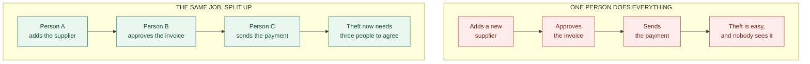
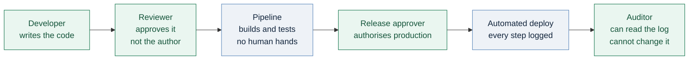
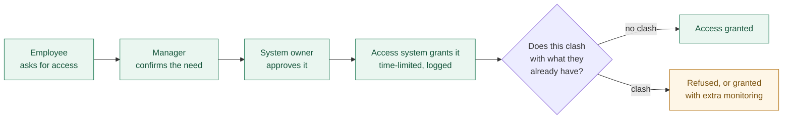

# Never Let One Person Hold Every Key: Separation of Duties

### Part 3 of *Security Principles for Technology Companies*

---

> *Part 1 was about building security in layers. Part 2 was about keeping each person's access small. This one is about a third idea that is older than both: don't let any single person finish a sensitive job alone.*

---

## The simplest idea in security

Whoever writes the cheque should not be the person who signs it.

That is Separation of Duties, and you already understand it. Split a sensitive job into steps, and give the steps to different people. Now no single person can complete the job on their own — so no single person can quietly steal, cheat, or make a serious mistake that nobody catches.

The formal definition: **Separation of Duties (SoD) means dividing a task and its permissions among two or more people or systems, so that completing it requires more than one of them.** Sometimes it is called segregation of duties, or the two-person rule.

It matters because the other principles have a blind spot. Layered defences and minimal access both assume the danger is outside, or at least that the person holding the access is behaving normally. But what about the administrator who is *supposed* to have the keys? Least Privilege says give people only what their job needs. Separation of Duties asks a harder question: **what if the job itself is too powerful for one person?**

The answer is not to distrust your staff. It is to design work so that trust is never the only thing standing between you and a disaster — and, just as importantly, so that an honest person cannot be blamed for something they had no way to prevent.

---

## Where the idea comes from

This principle is not from cybersecurity. It is from accounting, and it is centuries old.

Double-entry bookkeeping, described by the Italian friar Luca Pacioli in 1494, already contained the seed: every transaction recorded twice, so the books cross-check each other. By the time modern banking arrived, the practice was routine — the clerk who records a payment is not the clerk who releases the cash, vaults need two keys turned at once, and "maker-checker" (one person prepares, another approves) became the default way money moves.

The military version is the **two-person rule**: certain orders, most famously those involving nuclear weapons, cannot be carried out by one individual acting alone.

Then came the corporate scandals. Enron and WorldCom collapsed in 2001 and 2002 after accounting fraud on an enormous scale, and the United States responded with the **Sarbanes-Oxley Act of 2002**, which forced public companies to prove they had real internal controls over financial reporting. Separation of Duties stopped being good practice and became something auditors checked and regulators enforced.

Cybersecurity inherited all of this. The principle now sits in the standards that govern IT: NIST SP 800-53 lists it as a control in its own right, ISO 27001 requires conflicting duties to be separated, and PCI DSS applies it to systems handling card data. The wording changed. The idea did not.

### Diagram 1 — why splitting a job works

*Fraud by one person becomes a conspiracy between three. That is a much harder thing to arrange, and a much easier thing to detect.*

---

## What you get out of it

**It makes insider fraud hard.** One dishonest person is a real risk in any organisation. Three dishonest people who trust each other enough to plan a crime together is rare — and every extra person involved is another chance the plan leaks.

**It catches honest mistakes.** This is the benefit people forget, and in most companies it is the one that pays off most often. A second pair of eyes on a change catches the wrong hostname, the missing WHERE clause, the firewall rule that was meant for staging. Most of what SoD prevents is not crime. It is Tuesday.

**It creates real accountability.** When each step has a named owner, the log tells you who did what. Vague shared responsibility becomes a specific record — useful during an incident, and essential afterwards.

**It protects the people doing the work.** If only one engineer could have deleted the database, that engineer is the suspect by default. If the deletion required two approvals, nobody is standing alone under suspicion. Good controls protect staff as much as assets.

**It keeps the audit trail honest.** If administrators can edit or delete the logs of their own actions, the logs prove nothing. Separating "runs the system" from "keeps the records" is what makes evidence trustworthy.

---

## What it looks like in an IT department

**Administrative access.** The person who requests access is not the person who approves it, and the person who approves it is not the person who technically grants it. One engineer should not be able to give themselves production rights by filling in their own form.

**Change management and deployment.** Nobody approves their own code. The author writes it, someone else reviews it, and a third role authorises the release to production. In practice the pipeline does the deploying, which is better still — the machine follows the rules exactly and never makes an exception because someone is in a hurry.

**Logging and monitoring.** System administrators should not be able to delete the audit logs of their own activity. Send logs to a separate system, owned by a different team, where records can be added but not altered.

**Incident response.** The person investigating an incident should not be the only person who can decide it is closed, and should not be the same person who owns the system under investigation. Otherwise you are asking someone to grade their own homework on the worst day of their year.

**Encryption keys.** Split control, so no one person can decrypt sensitive data alone. Half the key with one custodian, half with another — the digital version of a vault with two locks.

**Vendor and payment workflows.** The same rule as the finance department, because it is the same risk: whoever can create a supplier must not also be able to approve payments to it.

### Diagram 2 — separation of duties in a software release

*Four roles, and no one of them can put code into production alone. The two grey boxes are automation — which is often the easiest "second person" to hire.*

---

## The hard parts, and what to do about them

**"We are too small for this."** The most common objection, and often a fair one. A three-person team cannot split six roles. But small does not mean helpless. Automate the second check so the pipeline enforces what a colleague would have: require pull-request approval, block direct pushes to the main branch, forbid self-approval in the tooling. Where a human really cannot be found, use **compensating controls** — send an alert to a manager whenever a sensitive action happens, rotate who performs sensitive tasks, and have someone outside the team review the logs monthly. A control that detects afterwards is weaker than one that prevents, but it is far better than nothing, and auditors accept it when you document why.

**Speed.** Technology companies deploy many times a day, and any control that adds a human wait to every release will be removed within a month. The fix is to make the check automatic rather than manual. A rule enforced by the platform costs seconds. A rule enforced by finding someone on chat costs an afternoon and gets bypassed.

**Emergencies.** At 3 a.m. during a major outage there may be one engineer awake. Plan for it: a documented break-glass procedure that grants the extra rights, fires an alert, and triggers a mandatory review the next morning. The reviewer is the missing second person, arriving late. What you must not have is an undocumented habit of ignoring the rules under pressure, because that habit will be there on a normal day too.

**Conflicting roles creeping back.** People change teams and keep their old permissions, and after two years someone holds a combination nobody would ever have approved deliberately. Write down which pairs of permissions must never be held together — a short "toxic combinations" list — and have your access system check for them automatically, at the moment of granting and again at every quarterly review.

**Role sprawl.** Splitting duties can produce a hundred fiddly roles that nobody understands. Keep it proportionate. Apply strict separation to the handful of workflows that can really hurt you — payments, production access, key management, log integrity — and keep everything else simple.

**Collusion.** Be honest about the limit: SoD does not stop two people who decide to work together. It raises the cost and the number of people who must stay silent. Pair it with rotation, mandatory leave for sensitive roles (a practice banks use precisely because a fraud usually unravels while its author is away), and monitoring.

### Diagram 3 — an access request with the duties split

*Four different actors, and an automatic conflict check. Nobody can approve their own request.*

---

## What happens when it is missing

**Barings Bank, 1995.** Nick Leeson was both the head trader at the bank's Singapore operation and in charge of settling his own trades — the front office and the back office, in one person. That meant he could hide losses in an error account while continuing to report profits. By the time it unravelled, the losses were around £800 million and Britain's oldest merchant bank was gone, sold for one pound. There was no clever hack. There was one person doing two jobs that should never be held together.

**Société Générale, 2008.** Jérôme Kerviel ran up unauthorised positions that cost the bank roughly €4.9 billion. He had previously worked in the middle and back office, and understood the controls well enough to keep his trades hidden from them. The lesson is subtle and worth keeping: separation of duties is not only about today's job title. Deep knowledge of the checking process, carried into the role being checked, weakens the split.

**WorldCom, 2002.** Nearly $4 billion in improperly recorded expenses. What ended it was an internal audit team — a function deliberately independent of the finance department it was examining — pursuing the discrepancies against pressure to stop. Independence was the control that worked.

**And the successes, which nobody writes about.** This is the honest difficulty with SoD case studies: the failures make the news, while the successes look like nothing happening. Every day, maker-checker rules in banks stop payments that were entered wrongly or fraudulently, and no one hears about it. Every day, a code reviewer blocks a change that would have taken down production. After the Snowden disclosures, the NSA reduced its number of system administrators and introduced a two-person rule for sensitive operations — a control adopted precisely because one person had been able to act alone.

If your SoD controls are working, your evidence will be a quiet year and a boring audit. Learn to read that as a result.

---

## In short

Separation of Duties completes the set. Defense in Depth assumes your controls will fail and puts more behind them. Least Privilege limits what any one account can reach. Separation of Duties makes sure that the most dangerous jobs cannot be finished by one person acting alone — whether that person is malicious, careless, or simply having a bad night.

It is not about suspicion. It is about designing work so that a single mistake, or a single bad decision, is caught before it becomes a disaster — and so that the people doing sensitive work are never the only ones who could have done the damage.

Start small and proportionate. Pick the two or three workflows in your company that would hurt most if one person got them wrong. Split those. Automate the check so it costs seconds rather than hours. Then review it every quarter, because permissions drift back together on their own.

---

## Your turn

I would like to hear from people who have actually tried this, especially the parts that did not work:

- **How do you handle it in a small team?** If you have made SoD work with fewer than ten engineers, what did you split and what did you accept as too costly?
- **What did you automate?** Which check did you move from a person to the pipeline, and did anyone push back?
- **The 3 a.m. question:** what does your break-glass process look like, and has it ever been used well?
- **Has a separation of duties control ever caught something real for you** — fraud, or just a very bad deploy? Those stories are rarer online than they should be.

Tell me in the responses, and ask anything you would like me to go deeper on. I read and reply to all of them.

**Next in this series: Zero Trust** — what happens when you stop trusting the network entirely, and why "never trust, always verify" is harder to implement than it is to say.

---

*Sources worth linking if you want citations: Luca Pacioli, "Summa de Arithmetica" (1494), on double-entry bookkeeping; the Bank of England's Board of Banking Supervision report into the collapse of Barings (1995); Société Générale's own disclosures and the French banking regulator's findings on the 2008 trading loss; the Sarbanes-Oxley Act (2002); NIST SP 800-53 control AC-5 (Separation of Duties); ISO/IEC 27001 Annex A on segregation of duties; PCI DSS requirements on separating development and production duties.*

<!--
Publishing notes (delete this block before posting):
- Suggested subtitle: The oldest control in security is also the simplest — never let one person finish a dangerous job alone.
- Tags: Cybersecurity, Separation Of Duties, Information Security, Governance, Technology
- Replace the Part 1 / Part 2 references in the opening quote with links once those posts are live.
- Medium does not render Mermaid. Paste each of the three Mermaid blocks into mermaid.live,
  export as PNG, and upload the image in place of the code block. Everything else pastes in fine.
-->
