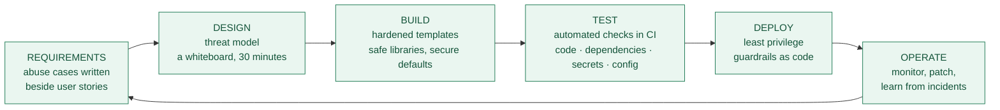
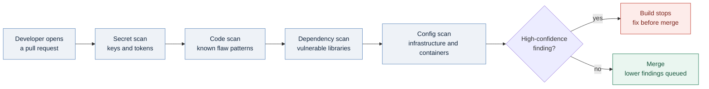

# Build It Safe, Don't Patch It Later: Secure by Design

### Part 4 of *Security Principles for Technology Companies*

---

> *So far this series has been about how to arrange the security you have: in layers, with minimal access, and split between people. This post is about something earlier — deciding what to build in the first place.*

---

## Fire exits are not an add-on

Nobody finishes a building and then asks where the fire exits should go. Exits, stairwells, alarms and fire doors are decided while the building is still lines on paper, because adding them afterwards means knocking down walls that are already holding up the roof.

Software is built the other way round more often than we like to admit. The feature gets designed, built and shipped, and then a security review happens — a pentest, an audit, a scanner — and the findings arrive when the walls are already up.

**Secure by Design means making security decisions while the design is still a drawing.** It is the shift from reacting to problems to preventing them: security as a property of the architecture, not a layer of fixes applied to it.

The distinction that makes this concrete is between a **bug** and a **flaw**:

- A **bug** is an implementation mistake — a missing input check, an off-by-one error. Tools find these, and they are usually cheap to fix.
- A **flaw** is a design mistake — the password reset flow that lets you reset someone else's account, the service that trusts a request just because it came from inside the network. No scanner will ever find these, because the code is doing exactly what it was designed to do. The design is the problem.

Roughly half of all security defects are estimated to be design flaws rather than coding bugs. That is the whole argument for this principle in one sentence: **you cannot test your way out of a bad design, so the design is where the work has to happen.**

### Diagram 1 — the same feature, two paths

```mermaid
flowchart TB
    subgraph BOLT["SECURITY ADDED AFTERWARDS"]
        direction LR
        B1["Feature designed<br/>security never discussed"] --> B2["Built and shipped"] --> B3["Pentest finds a<br/>design flaw"] --> B4["Redesign it, or accept<br/>the risk and hope"]
    end

    subgraph BUILT["SECURITY DESIGNED IN"]
        direction LR
        C1["Feature designed<br/>threat model in the room"] --> C2["Flaw found on a whiteboard<br/>costs one hour"] --> C3["Built on safe defaults"] --> C4["Pentest confirms<br/>instead of rescuing"]
    end

    classDef bad fill:#FDECEA,stroke:#C0392B,color:#7B241C
    classDef good fill:#EAF6F0,stroke:#1E7A54,color:#14543A
    class B1,B2,B3,B4 bad
    class C1,C2,C3,C4 good
```

*The bottom path is not slower. It just spends its time earlier, when changing your mind is free.*

---

## The core elements

### Threat modelling

Threat modelling sounds heavyweight and is not. At its simplest it is a team, a whiteboard, and four questions (a framing popularised by Adam Shostack):

1. **What are we building?** Draw it. Boxes, arrows, and where data crosses a boundary between things that trust each other differently.
2. **What can go wrong?** Walk the diagram. Who could lie about their identity, tamper with this message, read this data, or overwhelm this service?
3. **What are we going to do about it?** Pick the handful that matter and design them out.
4. **Did we do a good job?** Check later, honestly.

Thirty minutes at a whiteboard, and a photo of the drawing pasted into the ticket. That is a real threat model. Anything heavier than that will be done once and never again.

### Secure defaults

**The safe option should be the one you get by doing nothing.** Most people never change a default setting — which means the default *is* the security posture for the majority of your users.

In practice: deny access unless something explicitly allows it; encryption on, not optional; multi-factor authentication enabled at setup rather than buried in a settings page; no shipped default passwords; the risky feature switched off until someone deliberately turns it on. And when something breaks, **fail closed** — a system that grants access when the authorisation service is down has chosen the wrong default.

This idea is old. Saltzer and Schroeder listed "fail-safe defaults" and "economy of mechanism" as design principles back in 1975, in the same paper that gave us Least Privilege.

### Minimisation

Every feature, port, permission, dependency and stored field is something an attacker can use. So:

- **Attack surface:** turn things off. Fewer endpoints, fewer enabled modules, fewer open ports.
- **Data:** do not collect what you do not need, and delete what you no longer need. Data you never stored cannot be stolen — and in Europe this is not just advice, since GDPR requires data minimisation and "data protection by design and by default" as a legal obligation.
- **Complexity:** simple systems are easier to reason about and easier to secure. Complexity is where flaws hide.

### Building the earlier principles into the architecture

The first three posts in this series are design inputs, not operational chores. **Defense in Depth** means one compromised component should not reach everything. **Least Privilege** means every service gets its own identity and minimal permissions. **Separation of Duties** means no single person or process can complete a dangerous action alone. Decide these at design time and they are nearly free. Retrofit them and they are a project.

---

## Why it is worth it

**Fewer vulnerabilities, and fewer of the serious kind.** Design flaws are the expensive ones — they cause the breaches that require re-architecture rather than a patch.

**It costs less.** Fixing a flaw during design means changing a drawing. Fixing it after release means an emergency patch, a customer notification, possibly a regulator, and engineering time taken from whatever you had planned. The often-quoted multipliers vary and are hard to verify, but the direction is not in dispute by anyone who has done both.

**Less firefighting, which means more shipping.** Teams that build securely spend fewer weeks on unplanned security work. The counter-intuitive result is that designing for security makes a team faster over a year, not slower.

**Compliance becomes a by-product.** GDPR, the EU Cyber Resilience Act, and sector rules increasingly require security to be built in and demonstrable. If you designed it that way, the audit is paperwork. If you did not, the audit is a project.

**Trust.** Customers cannot inspect your code, but they notice how often you appear in a breach notification. In enterprise sales, the security questionnaire is now part of the buying process, and a good answer is a competitive advantage.

---

## How to actually do it

**Build a paved road.** This is the single most effective tactic. Do not hand developers a policy document and hope; give them a template, a hardened base image, an approved authentication library and a pipeline that already does the right thing. Make the secure path the *easiest* path and adoption stops being an argument. Security that competes with a deadline loses; security that comes free with the starter template wins.

**Put security in the definition of done.** Write abuse cases beside user stories: for "a user can reset their password," add "an attacker cannot reset someone else's." A requirement that is written down gets built. One that is assumed does not.

**Threat model the things that deserve it.** Anything handling money, personal data, authentication, or a new trust boundary. Not every small change.

**Use security champions.** Most companies have roughly one security engineer for every hundred developers, so a central team reviewing everything is arithmetic that does not work. Train an interested developer in each team, give them time and a direct line to security, and let them handle the routine questions.

**Automate the checks in CI/CD.** Secret scanning, code scanning, dependency scanning, and infrastructure-as-code and container checks — running on every pull request, giving feedback in minutes while the developer still has the context in their head.

One caveat that decides whether this works: **only fail the build on high-confidence, exploitable findings.** A pipeline that blocks merges over speculative low-severity noise will be disabled within a month, and you will have traded a real control for a bad reputation. Tune it, prioritise what is reachable in your code, and queue the rest.

**Feed incidents back into the templates.** When something goes wrong, fix the instance — then fix the template, the library or the pipeline rule so the same mistake cannot be made by the next team.

### Diagram 2 — a secure development lifecycle

*Security appears at every stage, and the loop closes: what you learn in production changes what you build next.*

### Diagram 3 — automated checks on every change

*Note the diamond. Blocking on everything is how teams learn to switch the checks off.*

---

## The hard parts

**"Security will slow us down."** Sometimes it genuinely does, and pretending otherwise costs you credibility. The honest answer is that it moves work earlier rather than adding it, and that the paved road is what makes the trade favourable. Measure it: track unplanned security work per quarter and show the number falling.

**No security people.** Automation plus champions, as above. Also accept that you cannot review everything — pick the risky changes deliberately rather than reviewing whatever happens to be noticed.

**Legacy systems you cannot redesign.** You will not rebuild the ten-year-old monolith, and you should not pretend you will. Contain it instead: put it behind a gateway that validates input, restrict what it can reach, monitor it closely, and apply Secure by Design strictly to everything new. Replace pieces gradually as you touch them.

**Threat modelling feels like a ceremony.** It becomes one if you use a heavy template. Four questions, thirty minutes, a photo of the whiteboard.

**Scanner noise.** Hundreds of findings, most of them not exploitable in your context, is not a security programme — it is a backlog nobody reads. Tune aggressively, prioritise what is actually reachable, and protect the credibility of the alerts that matter.

**Nobody owns it.** If security is everyone's job in general, it is nobody's job in particular. Name owners for the architecture decisions, record them, and revisit them.

---

## When it worked

**Cloud storage defaults.** Publicly exposed storage buckets caused a long run of data leaks through the late 2010s — usually not a break-in, just a setting somebody changed and forgot. The fix that ended most of it was not better training; it was providers changing the defaults, blocking public access on new buckets unless an administrator explicitly and knowingly turns it off. One default, changed at the platform level, removed an entire category of breach across the industry.

**Phone app sandboxing.** Modern mobile operating systems assume some installed apps will be malicious, so each app runs isolated and must ask permission for the camera, location or contacts. This is architecture, not a checklist — a malicious app is contained by design rather than detected after the fact.

**Browser sandboxing and site isolation.** Browsers process untrusted code from the entire internet all day, which is an impossible security problem if you try to solve it by having no bugs. Instead they were designed on the assumption that bugs will exist: each site is isolated in its own low-privilege process, so compromising the rendering engine does not hand over the machine. It is Defense in Depth, decided at architecture time.

**Memory-safe languages.** Memory-safety bugs dominated serious vulnerabilities in large C and C++ codebases for decades. Google's published data from Android shows that as new code shifted to memory-safe languages such as Rust, the proportion of memory-safety vulnerabilities fell sharply — without rewriting the old code. Choosing a language is a design decision that eliminates whole bug classes rather than finding them one at a time.

**And the counter-example.** The Mirai botnet in 2016 hijacked hundreds of thousands of cameras and routers using a short list of factory-default passwords, then used them to knock significant parts of the internet offline. Nothing was hacked in any sophisticated sense. The devices did exactly what they were designed to do. The design was the vulnerability — which is why default passwords are now banned outright for consumer devices in the UK, and why the EU Cyber Resilience Act is pushing security requirements onto manufacturers rather than users.

Regulators, in other words, have started making Secure by Design mandatory. CISA and international partners have published guidance urging vendors to take on this responsibility instead of shipping the burden to customers. This is moving from best practice toward baseline expectation.

---

## Where to start

Secure by Design is not a tool you buy or a phase you insert. It is a set of decisions made earlier than most teams are used to making them, by people who are usually not called security engineers.

You do not need a programme to begin. Pick one thing:

- **Threat model your next feature.** Four questions, half an hour, before any code is written. Just once, to see what it catches.
- **Look at one default.** Find a setting in your product where the safe option is not the one users get automatically, and change it.
- **Fix a template, not just a bug.** The next time something is wrong, fix the shared library or starter project so the next team cannot repeat it.

Then ask yourself the question this whole post is built around: **in your last three features, when was security first discussed — while it was a drawing, or after it was built?**

If the answer is "after," you already know where the cheapest improvement is.

---

## Over to you

- **What does your paved road look like?** If your team has a starter template that makes the secure choice automatic, what is in it — and what did you have to fight for?
- **Has threat modelling ever paid off for you?** I would like to hear about a flaw caught on a whiteboard that would have been expensive later.
- **Where did the automation go wrong?** Scanner noise, blocked builds, disabled checks — those stories are more instructive than the success ones.
- **And for anyone stuck with legacy:** what has actually worked for containing a system you cannot redesign?

Share it in the responses, and ask me anything you want expanded. I reply to all of them.

**Next in this series: Zero Trust** — what happens when you stop trusting the network entirely, and why "never trust, always verify" is much harder to implement than it is to say.

---

*Sources worth linking if you want citations: Jerome Saltzer and Michael Schroeder, "The Protection of Information in Computer Systems" (1975); Adam Shostack, "Threat Modeling: Designing for Security" (2014) and the Threat Modeling Manifesto; Microsoft's Security Development Lifecycle documentation; OWASP SAMM and the OWASP Top 10; Google's Android security reports on memory-safe languages; the Chromium project's documentation on sandboxing and site isolation; AWS documentation on S3 Block Public Access defaults; CISA and international partners, "Secure by Design" guidance; GDPR Article 25 (data protection by design and by default); the EU Cyber Resilience Act; the UK Product Security and Telecommunications Infrastructure Act on default passwords.*

<!--
Publishing notes (delete this block before posting):
- Suggested subtitle: You cannot test your way out of a bad design — so the design is where the work has to happen.
- Tags: Cybersecurity, Secure By Design, Software Development, Application Security, Technology
- Add links to Parts 1–3 in the opening quote once they are published.
- Medium does not render Mermaid. Paste each of the three Mermaid blocks into mermaid.live,
  export as PNG, and upload the image in place of the code block. Everything else pastes in fine.
-->
