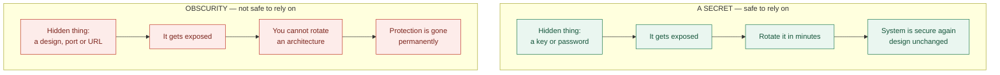
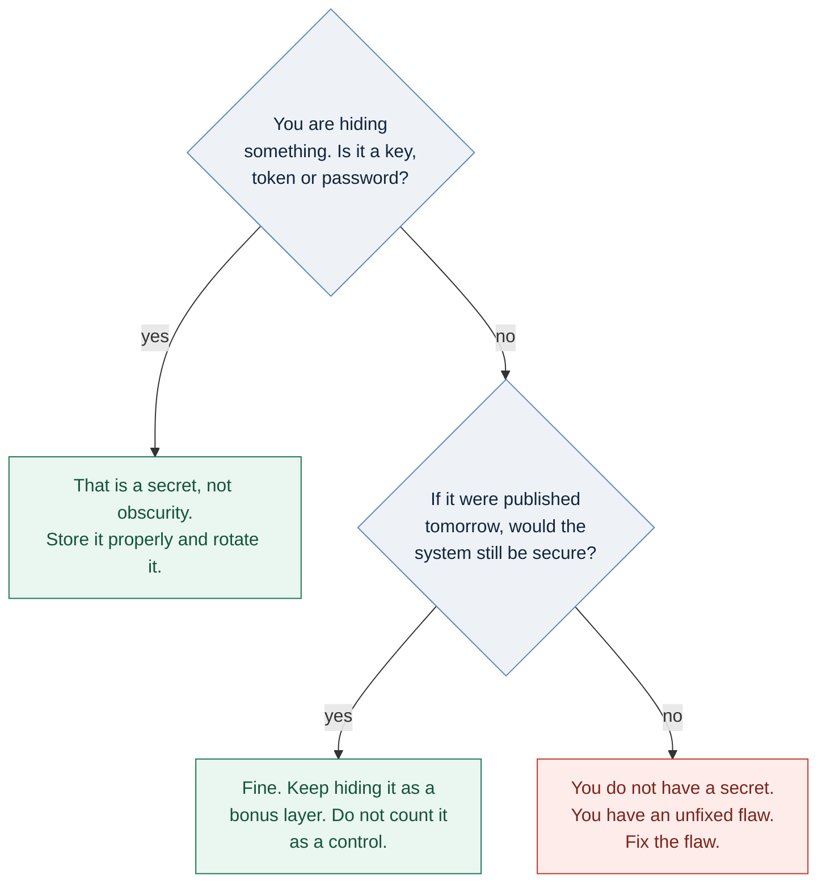
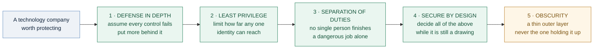

# A Hidden Door Is Still a Door: Security Through Obscurity

### Part 5 — the final post in *Security Principles for Technology Companies*

---

> *The four principles before this one were things I would recommend without hesitation. This one is different. It is the principle the security community argues about, and the argument is worth having properly rather than settling with a slogan.*

---

## The most repeated line in security

**Security Through Obscurity means trying to make a system safer by hiding how it works** — the design, the source code, the port number, the URL nobody has been told about.

Say the phrase in a room of security engineers and someone will reply "obscurity is not security" before you finish the sentence. It is the field's most reliable reflex, and like most reflexes it is roughly right and slightly wrong.

Roughly right, because the idea has been discredited for a very long time. In 1883 the Dutch cryptographer Auguste Kerckhoffs wrote that a cipher must remain secure even if everything about it except the key becomes public. Claude Shannon later put it more bluntly: assume the enemy knows the system. Saltzer and Schroeder listed "open design" among their principles in 1975 — the same paper that gave us Least Privilege and secure defaults. Modern guidance says the same: system security should not depend on the secrecy of its implementation.

Slightly wrong, because in practice hiding things does sometimes make an attacker's life harder, and pretending otherwise makes security people sound dogmatic to the engineers they are trying to persuade.

The accurate version is longer and less satisfying, which is presumably why nobody chants it:

> **Obscurity is not a substitute for security. It can, occasionally, be a thin extra layer on top of it.**

The rest of this post is about telling those two situations apart.

---

## First, a distinction that settles most arguments

People conflate two different things, and almost every confused debate about obscurity comes from that.

A **secret** is a piece of information you can change cheaply if it leaks: a password, an API key, a private key, a session token. Keeping those hidden is not obscurity. It is the entire basis of modern cryptography, and Kerckhoffs was arguing *for* it — he wanted security to rest on the key precisely so that everything else could be public.

**Obscurity** is hiding something you cannot change cheaply: your architecture, your source code, the port a service listens on, the name of an internal endpoint. When that leaks, you cannot rotate it. Redesigning a system is not a Tuesday afternoon task.

So the test is simple: **can you replace the hidden thing in an hour, or would replacing it mean rebuilding something?** The first is a secret and you may rely on it. The second is obscurity and you may not.

### Diagram 1 — the rotation test

*Same act of hiding. Completely different consequences when it fails.*

---

## Where obscurity genuinely helps

Being fair to the idea, here is where hiding things does real work.

**Cutting noise.** Move SSH from port 22 to something unusual and your logs get dramatically quieter, because most of that traffic is untargeted scanning. This is not security — anyone who scans all ports finds you in seconds — but fewer junk alerts means the real one is easier to see. Call it noise reduction and it is defensible. Call it a security control and you are lying to yourself.

**Not advertising your version numbers.** Stripping software versions from banners, headers and error pages does not fix anything, but it does make you a worse match for automated tools that scan for "everyone running version X." Free to do, so do it.

**Not publishing your internal map.** Network diagrams, infrastructure details in job adverts, internal hostnames in public repositories, verbose stack traces shown to users. None of this is a control, but handing an attacker a free reconnaissance report is an unforced error.

**Code obfuscation on the client side.** When your code runs on someone else's device — a mobile app, a game client — you have to assume it will eventually be reverse-engineered. Obfuscation cannot prevent that. What it does is raise the effort from minutes to weeks, which for anti-cheat, anti-piracy and anti-tampering is sometimes commercially sufficient. It buys time. Time is worth something. It is not the same as safety.

**Randomisation.** Techniques such as address space layout randomisation make memory locations unpredictable, so an attacker cannot rely on knowing where things are. This is often filed under obscurity but it belongs on the other side of the line: the randomness is generated fresh for each instance, so it behaves like a key, not like a hidden design.

**Deception.** Honeypots, canary tokens and fake credentials planted where an intruder will find them are the one place secrecy shines — because they are *detective* rather than preventive. A fake admin account that nobody legitimate would ever touch, wired to an alarm, produces a very high-quality alert. This is one of the cheapest and most under-used controls in the field.

**Holding vulnerability details until a patch exists.** Coordinated disclosure is deliberate, temporary secrecy in the users' interest, and almost nobody disputes it.

---

## And where it fails, badly

**It creates complacency.** This is the real cost, and it is not a technical one. Teams that believe an endpoint is safe because it is unlisted stop asking whether it has authentication. Obscurity does not just fail to protect — it removes the pressure to build the thing that would have.

**It fails completely against anyone already inside.** A departing employee, a contractor, a compromised laptop. Every internal detail is known to the people who work there, which means your "hidden" architecture is documented in the heads of everyone who has ever left the company.

**It cannot be recovered.** Rotate a leaked password and you are fine. There is no equivalent move when your design is published.

**It blocks the review that finds real flaws.** A design nobody outside can examine is a design nobody outside can correct. Secret cryptographic algorithms have a particularly grim record here: the proprietary ciphers used in early GSM phone calls, DVD copy protection, and the MIFARE Classic contactless cards used for building access and transport worldwide were all kept secret, all eventually reverse-engineered, and all found to be seriously weak. In each case the secrecy did not make them strong. It delayed the discovery that they were weak — while millions of them were deployed in the field.

**It hurts your own team first.** A system only three people understand is not secure, it is fragile. When those three are asleep, on holiday, or gone, the obscurity is working perfectly against exactly the wrong people.

**It hides the problem instead of fixing it.** "That admin page isn't linked from anywhere" is a sentence that means nobody put authentication on the admin page. Unlisted URLs get found — through logs, referrer headers, browser history, search engines, and simple guessing. A hidden door with no lock is still an unlocked door.

### Diagram 2 — a decision you can apply in ten seconds

---

## The other extreme is not automatically right either

The usual counter to obscurity is transparency: publish the design, open the source, invite peer review, run a bug bounty. Openness lets people find your flaws before your attackers do, and for anything cryptographic it is not optional — nobody should trust an algorithm that has not been publicly analysed for years.

But "many eyes make all bugs shallow" deserves more scepticism than it usually gets. Heartbleed sat in OpenSSL, one of the most widely deployed pieces of software on earth, for around two years. Log4Shell sat in a ubiquitous Java logging library for the better part of a decade. Both were open source. The eyes were theoretically there; the funded, sustained attention was not.

The honest conclusion is that **openness enables review but does not perform it.** Transparency is a precondition, not a control. If you open your source and nobody is paid to look at it, you have published your flaws rather than fixed them.

So the goal is not maximum secrecy or maximum openness. It is that your security rests on things that can be changed — keys, credentials, configuration — while the things that cannot be changed are strong enough to survive being known. That is exactly what Kerckhoffs was asking for, and it is compatible with keeping your internal network diagram off the internet.

---

## Practical recommendations

1. **Design as though the attacker has your documentation.** Then ask what still protects you. That answer is your actual security posture, and everything else is decoration.
2. **Never let obscurity be the only thing on a path.** The hidden endpoint still needs authentication. The non-standard port still needs a firewall rule. Every time.
3. **Do not count it in a risk assessment.** If "the URL is not published" appears in your list of mitigating controls, delete the line and re-score the risk honestly. This is where obscurity does its real damage: not by failing, but by making a risk look handled.
4. **Reduce information leakage anyway — as hygiene, not as a control.** Strip version banners and verbose errors. Keep configuration and infrastructure detail out of public repositories. Scan your own public footprint occasionally. It costs almost nothing and it removes free reconnaissance.
5. **Invest in deception instead.** Canary tokens and fake credentials give you high-quality detection for very little money, and they use secrecy in the one way that reliably works.
6. **Document internally what you hide externally.** Your own engineers should never be the ones confused by your architecture at 3 a.m.
7. **Test white-box.** Give your penetration testers the design documents and the source. If they still cannot get in, your security is real. If handing over the docs is what breaks you, obscurity was never a layer — it was the whole building.
8. **Publish a disclosure policy and never punish researchers.** Someone who tells you about a flaw is doing you a favour, and organisations that respond with lawyers get their vulnerabilities disclosed by strangers instead.

---

## The uncomfortable questions

This is where I would rather ask than assert, because the ethics here are genuinely unsettled.

**Who is protected when a vendor stays quiet?** Delaying disclosure until a patch exists protects users. Delaying it because the news would be embarrassing protects the vendor. The action looks identical from the outside, and only the motive differs. How would a customer ever tell them apart?

**Is hiding a known flaw from your users defensible?** If you know your product has a weakness and you decide not to say so while you work on it, you have made a decision about *their* risk on their behalf, without asking. Sometimes that is genuinely the right call. It is never a neutral one.

**Does obscurity move risk from those who can measure it to those who cannot?** A company can assess its own hidden weaknesses. Its customers cannot. Regulators have begun answering this question themselves — with mandatory breach notification, with rules against shipping default passwords, and with legislation obliging manufacturers to take responsibility for the security of what they sell.

**And when governments do it?** Secret standards, undisclosed vulnerabilities kept for intelligence use, restrictions on publishing research. The argument for is that some knowledge is dangerous in the open. The argument against is that a vulnerability withheld from a vendor is a vulnerability left open in everyone's systems, including your hospital's.

I do not think these have clean answers. I think a security professional should have thought about them before the situation arrives.

---

## Where the series lands

Five posts, and the through-line has been consistent: **good security does not depend on any single thing going right.**

Defense in Depth assumes every control eventually fails and puts more behind it. Least Privilege limits how far any one identity can reach. Separation of Duties makes sure no single person can finish a dangerous job alone. Secure by Design moves all of those decisions to the point where they are still cheap to make. And obscurity — treated correctly — is a thin outer layer that reduces noise and buys a little time, sitting on top of controls that would hold perfectly well without it.

### Diagram 3 — the five principles together

*Four load-bearing principles and one decorative one. The mistake is treating the fifth like the first four.*

The simplest way to hold all of it: **obscurity is seasoning, not a meal.** A little makes the dish better. Serve it on its own and someone is going home hungry — probably you, at 3 a.m., during an incident.

---

## Over to you — and thank you for reading

This is the last post in the series, so I would especially like to hear where you disagree:

- **Where do you draw the line?** Is changing the SSH port sensible hygiene or self-deception? I have argued the first, narrowly. I know plenty of people who would argue the second.
- **Has obscurity ever actually saved you** — bought you real time during an incident or a patch window? I would like a concrete story, because they are rarer in print than the failures.
- **What is hidden in your own environment right now** that would stop protecting you the moment somebody published it?
- **And the ethical one:** where does responsible delay end and self-serving silence begin?

Leave it in the responses. And if the series was useful, tell me which principle was hardest to apply where you work — that is what I would build the next series around.

---

*Sources worth linking if you want citations: Auguste Kerckhoffs, "La cryptographie militaire" (1883); Claude Shannon, "Communication Theory of Secrecy Systems" (1949); Jerome Saltzer and Michael Schroeder, "The Protection of Information in Computer Systems" (1975), on open design; NIST SP 800-123 on not relying on implementation secrecy; the published academic analyses of the MIFARE Classic Crypto-1 cipher, GSM A5/1 and DVD CSS; the OpenSSL Heartbleed and Apache Log4Shell advisories; Thinkst's research and tooling on canary tokens; the EU Cyber Resilience Act and the UK PSTI Act on default passwords and vendor responsibility.*

<!--
Publishing notes (delete this block before posting):
- Suggested subtitle: Obscurity is seasoning, not a meal — a balanced look at the field's most argued-about principle.
- Tags: Cybersecurity, Security Through Obscurity, Information Security, Kerckhoffs Principle, Technology
- Add links to Parts 1–4 in the opening quote and in the closing summary once they are published.
- Medium does not render Mermaid. Paste each of the three Mermaid blocks into mermaid.live,
  export as PNG, and upload the image in place of the code block. Everything else pastes in fine.
-->
