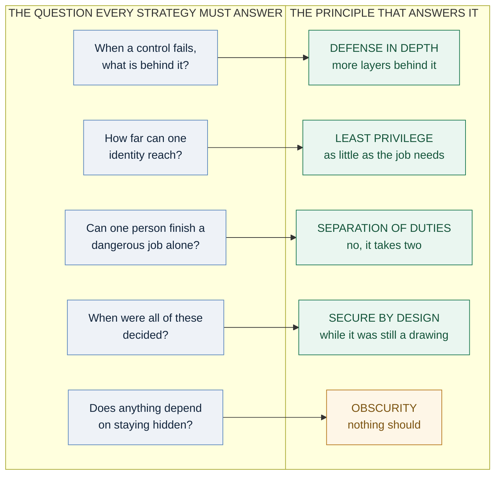
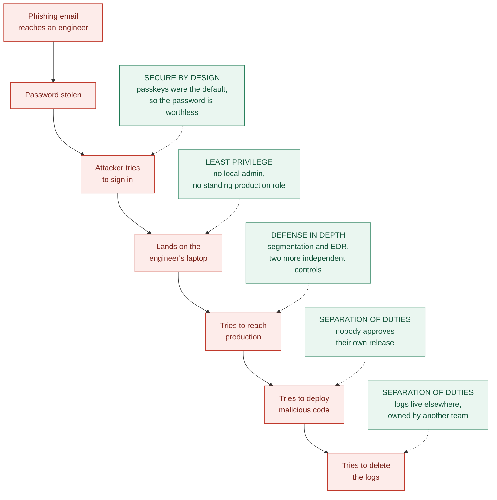
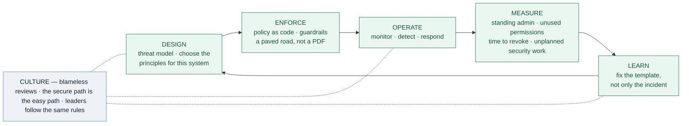

# Five Principles, One Strategy: Making Them Work Together

### Part 6 — the capstone of *Security Principles for Technology Companies*

---

> *Five posts, five principles. This one is about what happens when you stop treating them as a reading list and start treating them as a single design.*

---

## The problem with a list

Most security strategies are a list of good ideas that nobody has connected. Each one is defensible on its own. Together they leave gaps that nobody owns, because the gaps live between the items rather than inside them.

Here is the thing worth noticing about the five principles in this series: **they are not five separate controls. They are five different questions about the same system.**

- *When a control fails, what is behind it?* → **Defense in Depth**
- *How far can any one identity reach?* → **Least Privilege**
- *Can one person finish a dangerous job alone?* → **Separation of Duties**
- *When were all of those decided?* → **Secure by Design**
- *Does anything depend on staying hidden?* → **Security Through Obscurity** (answer: nothing should)

Four of those are load-bearing. The fifth is a warning label. Ask all five about any system you own and you have done more real security thinking than most risk registers contain.

### Diagram 1 — five questions, five answers

---

## How they hold each other up

The principles are not parallel. They depend on one another, and each one covers a specific weakness in the others.

**Least Privilege is what makes Defense in Depth real.** You can build twelve layers, but if every engineer holds a credential that opens all twelve, you have one layer with extra paperwork. Depth is vertical, privilege is horizontal, and you need both dimensions or you have a line rather than a shape.

**Separation of Duties covers what Least Privilege cannot.** Least Privilege asks what an account should be able to reach. But some jobs are legitimately powerful — someone *has* to be able to deploy, approve payments, or manage keys. For those, the answer is not less access, it is more people. SoD is Least Privilege applied to a workflow instead of an account.

**Secure by Design is when all of the above get decided.** It is not a fourth control sitting beside the others; it is the time axis running through them. Segmentation designed in is free. Segmentation retrofitted is a year-long project that half finishes. Every principle in this series is cheap at design time and expensive afterwards.

**And obscurity multiplies nothing.** It is the only one on the list that does not strengthen the others. At best it reduces noise; at worst it convinces you the other four are unnecessary. That is why it came last, and why it gets a different colour in every diagram I have drawn.

### A concrete walk-through

An engineer at a mid-sized company clicks a convincing phishing link on a Tuesday morning. Here is what each principle does about it.

**The password is stolen — and is worthless.** *Secure by Design* meant the company rolled out phishing-resistant authentication as the default when the identity system was set up, not as a project scheduled for next quarter. The stolen password alone does not authenticate.

Assume the attacker gets further anyway — a session token, a device compromise, something. Depth means never resting on one control.

**They land on the laptop, and find a standard user.** *Least Privilege* removed local administrator rights, so most of the standard next moves fail or get noisy. There is no standing production role attached to this account to steal.

**They try to reach production.** *Defense in Depth*: network segmentation blocks the route, endpoint detection flags the behaviour, and the two fail for different reasons — a misconfiguration would not disable both.

**They try to ship malicious code instead.** *Separation of Duties*: nobody approves their own release. The attacker would need a second engineer's approval, from a second compromised account, without either person noticing.

**They try to delete the logs to cover their tracks.** *Separation of Duties* again: logs go to a system owned by a different team, where records can be added but not altered. The evidence survives.

**And the "hidden" internal admin panel?** *Obscurity* was never counted as a control, so the panel has real authentication on it. Nobody wrote "not linked from anywhere" in a risk assessment and moved on.

No single principle stopped the attack. Each one narrowed it, and the compromise ends as an incident report rather than a breach notification. **That is what a cohesive strategy actually looks like from the inside — not one heroic control, but a series of small, boring refusals.**

### Diagram 2 — the same attack, principle by principle

---

## Where they pull against each other

A capstone post that claimed these five principles fit together perfectly would be dishonest, and you would notice the first time you tried to implement them. They conflict, and knowing where saves you months.

**Separation of Duties needs people. Least Privilege needs fewer of them holding access.** In a small team these pull in opposite directions: you cannot split six roles across four engineers while also minimising who has access to anything. The resolution is to let automation be the second person — the pipeline enforces the split — and to accept compensating controls where a human genuinely cannot be found.

**Defense in Depth adds friction. Friction breaks Least Privilege.** Every extra layer is another approval, another step, another reason for someone to create a shared account and paste the credentials into a chat channel. Layers you add without watching their human cost will quietly manufacture the exact problem you were trying to prevent.

**Secure by Design competes with shipping.** Doing it properly means spending time before the deadline on something that has no visible output. This tension never fully resolves; it is managed by making the secure path the fastest path, so the trade stops being a trade.

**Transparency and obscurity point opposite ways.** Open design invites review; not publishing your network map denies free reconnaissance. Both are correct. The line between them is the rotation test from Part 5: rely on what you can change, never on what you cannot.

Naming these tensions out loud is what separates a strategy from a poster. Every real security programme is a set of negotiated trade-offs, and the ones that fail are usually the ones that pretended there were none.

---

## A framework you can actually run

Here is how to turn five principles into something that survives contact with a roadmap.

### Step 1 — Know what you are protecting

Before any principle applies, list what would genuinely hurt to lose: customer data, production systems, the build pipeline, the identity provider, money movement. Rank them. **A strategy that protects everything equally protects nothing well**, because attention is the scarcest resource you have.

### Step 2 — Ask the five questions of each one

For each item on that list, run the five questions from the top of this post. Write down the answers. The gaps will be obvious and specific, which is exactly what a vague strategy never produces.

### Step 3 — Fix the design, not just the instance

When you find a gap, ask where it came from. If a service has too many permissions, fix that service — then fix the template that created it, so the next twenty services do not repeat it. This is Secure by Design applied to your own security work, and it is the difference between a programme that compounds and one that treads water.

### Step 4 — Enforce it in code, not in a document

A policy PDF changes nobody's behaviour. Guardrails do: branch protection that blocks self-approval, infrastructure modules that are private by default, pipeline checks that fail on real findings, identity systems that expire access automatically. Every rule you can move from a document into a platform is a rule that stops depending on memory and goodwill. Where you must grant an exception, give it an expiry date — permanent exceptions are how strategies quietly die.

### Step 5 — Build the culture that keeps it alive

This is the part that cannot be automated, and it is what most programmes get wrong.

- **Blameless reviews.** If people are punished for reporting mistakes, you lose your best detection layer — the humans who noticed something felt wrong.
- **The secure path must be the easy path.** Every time security is more work than the alternative, you are relying on discipline. Discipline runs out at 5 p.m. on a Friday before a release.
- **Leaders follow the same rules.** An executive with an exception from MFA is worth more to an attacker than any technical weakness, and it tells everyone else what the policy is really worth.
- **Security champions inside teams**, not a central team acting as a gate. One security engineer per hundred developers is arithmetic that only works through delegation.

### Step 6 — Measure, and let the numbers change the design

Pick a handful of numbers that would embarrass you if they got worse, and review them quarterly:

- Percentage of accounts with standing administrative access
- Permissions granted but never used in 90 days
- Time from an employee's departure to full revocation
- Mean time to patch a critical vulnerability
- Number of policy exceptions, and how many have expired
- Unplanned security work per quarter — the number that shows whether designing security in is paying off

Then close the loop: every incident, audit finding and red-team result should change a template, a guardrail or a default. If it only changes one system, you have fixed an instance and learned nothing.

### Diagram 3 — the loop that keeps it alive

*Culture is not a stage in the loop. It is the thing that decides whether the loop keeps turning when nobody is watching.*

---

## What about what comes next

New technology arrives constantly, and with it the claim that everything we knew is obsolete. Look closely and the same five questions keep working — because they are questions about consequences, and consequences do not go out of date.

**AI systems and autonomous agents.** An agent that reads untrusted input and can also act on your systems is a genuinely new shape of risk: the instructions and the data arrive through the same channel, so the old assumption that you control what your software is being told no longer holds. But the mitigations are the familiar ones. Give the agent its own identity with minimal, scoped permissions (*Least Privilege*). Require human approval for consequential actions (*Separation of Duties*). Never hand it standing production credentials, and decide its boundaries when you design it rather than after an incident (*Secure by Design*). Assume its guardrails will sometimes be talked around, and put something behind them (*Defense in Depth*).

**An explosion of non-human identities.** Services, workloads, agents and integrations already outnumber employees in most companies, and the gap is widening. Least Privilege at machine scale cannot be done by hand — it needs short-lived credentials, workload identity and automated review as design defaults.

**Supply chain.** Your dependencies are your attack surface. Software bills of materials, provenance and signing are Defense in Depth applied to code you did not write, and regulation across the EU is now pushing this responsibility onto vendors rather than users.

**Post-quantum cryptography.** Data captured today may be decrypted later. The practical response is crypto agility — the ability to change algorithms without redesigning the system — which is a Secure by Design property, decided years before you need it.

**Zero Trust.** Worth naming plainly: it is not a product. It is Least Privilege and Defense in Depth applied to the network, with trust based on verified identity and device state rather than on which cable you are plugged into. If you have implemented the principles in this series, you have most of it already.

**Regulation.** In Europe, NIS2, DORA and the Cyber Resilience Act are all moving the same direction: security must be designed in, demonstrable, and the vendor's responsibility. Companies that adopted these principles will find compliance is largely documentation. Companies that did not will find it is a rebuild.

The pattern: **the technology changes, the questions do not.** Kerckhoffs wrote his in 1883, Saltzer and Schroeder wrote theirs in 1975, and both still apply to systems neither could have imagined.

---

## Now assess your own

Do not take this as a summary to nod along with. Take it as a checklist and answer honestly — the point is the questions you cannot answer comfortably.

1. **Name one control you rely on.** What happens the day it fails? If the answer is "we'd be in trouble," that is a single wall.
2. **What percentage of your engineers hold standing production access right now?** Not the policy figure — the real one.
3. **Which single person could do the most damage today, deliberately or by accident?** What would it take to make that require two people?
4. **In your last three features, when was security first discussed** — while it was a drawing, or after it was built?
5. **What are you hiding that you are quietly counting on?** If it were published tomorrow, would anything actually break?
6. **When was an unnecessary permission last removed** in your organisation, and who did it? If nobody owns removal, access is only growing.
7. **What did your last incident change?** If it changed one system and not a template, a default or a guardrail, it will happen again somewhere else.

If several of those made you uncomfortable, that is the correct result. **A security strategy is not a state you reach. It is a set of questions you keep asking, on a schedule, with the honesty to act on the answers.**

Pick the one that bothered you most. Fix that. Then ask the seven again next quarter.

---

## Thank you for reading

That is the series: five principles, and one way of putting them together. If it has been useful, the most valuable thing you can do with it is not to share it — it is to run those seven questions against something you are responsible for this week.

I would like to hear how it goes:

- **Which question was hardest to answer honestly?**
- **Where do these principles conflict most in your environment**, and how have you resolved it?
- **What would you have added to this series** — or argued with?

Leave it in the responses. I read all of them, and disagreement has been the most useful feedback throughout.

---

*Sources worth linking if you want citations: Auguste Kerckhoffs (1883); Jerome Saltzer and Michael Schroeder, "The Protection of Information in Computer Systems" (1975); NIST SP 800-53 and the NIST Cybersecurity Framework; NIST SP 800-207 on Zero Trust Architecture; the OWASP Top 10 for Large Language Model Applications on prompt injection; CISA and international partners, "Secure by Design"; NIST's post-quantum cryptography standards; the EU Cyber Resilience Act, NIS2 Directive and DORA.*

<!--
Publishing notes (delete this block before posting):
- Suggested subtitle: The principles are not five separate controls — they are five questions about the same system.
- Tags: Cybersecurity, Security Strategy, Information Security, Security Architecture, Technology
- Add links to Parts 1–5 in the opening quote and wherever each principle is first named.
- Medium does not render Mermaid. Paste each of the three Mermaid blocks into mermaid.live,
  export as PNG, and upload the image in place of the code block. Everything else pastes in fine.
-->
